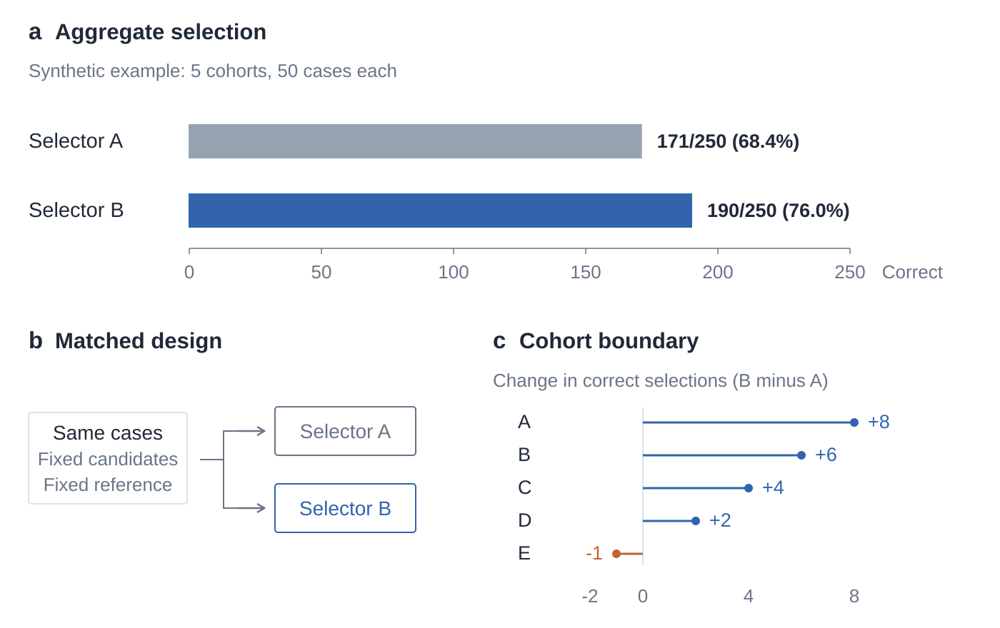

# Simple Fig Skill

简洁的科研论文绘图 skill：**每个面板只有一条短标题，解释放图注，让数据和真实素材成为主角。**

适合方法流程、实验比较、真实图片与定量结果组合。保留克制的机器学习论文风格，融入 nature-skills 中有价值的证据组织、视觉层级与最终尺寸检查；不是 ICLR 或 Nature 官方模板。



上图只演示设计：主结果占据上半部，下方分别解释对照设计与失效边界，保留负向子组。**所有数字都是人为构造的演示值，不是实验结果。** [图注与数据说明](examples/evidence-design.md)。

## 这次融合了什么

| 保留 Simple Fig | 吸收并改写的设计方法 |
|---|---|
| 短标题、无横幅、解释放图注 | 一个核心问题，各面板承担不同证据角色 |
| 原图优先、SVG 可编辑 | 主结果突出，配合必要对照与失效边界 |
| 默认克制配色，不重染科学图像 | 跨面板语义一致，可选协调色系、共享图例 |
| 轻量、按需读取、无新增运行依赖 | 物理宽度 PDF、小字号与文字碰撞检查 |

没有照搬强制选择 Python/R、全局偏好持久化、安装钩子或外部图像 API，也没有引入一整套依赖。对“统一截断纵轴”“每列独立归一化”等规则作了限制，避免美化导致误读。详见[更新记录](CHANGELOG.md)和[来源署名](THIRD_PARTY_NOTICES.md)。

## 使用

将完整仓库放入使用方的技能目录。例如在 Codex 中：

```bash
git clone https://github.com/Biogod2020/simple-fig-skill.git ~/.codex/skills/simple-fig-skill
```

已经以 git clone 安装的版本，在该目录执行 `git pull --ff-only`；复制安装则更新完整目录，不只替换 SKILL.md。

示例请求：

> 使用 $simple-fig-skill，根据这些结果和原图素材重画论文图。保留真实图像，围绕核心结论安排主结果、必要对照和失败边界，每个面板只留一条短标题。按 180 mm 宽设计，输出可编辑 SVG、PDF、图注与检查记录。

技能入口是 [SKILL.md](SKILL.md)。按任务选择布局，**不固定图数或面板数**；不自行发布文件、安装依赖、改变实验或把演示数据当作证据。已有的 Python/R 绘图流程可以继续使用。

## 工具与参考

- [原有风格指南](references/style-guide.md)：标题、配色、留白与字号。
- [证据与出版设计](references/evidence-design.md)：面板角色、版式、色系和图形选择，复杂设计时按需读取。
- [导出与检查](references/export-and-check.md)：浏览器导出、实际宽度、检查边界与 LaTeX。
- [SVG 工具](scripts/svg_figure.py)、[新示例源码](scripts/make_evidence_example.py)与[可编辑 SVG](examples/evidence-design.svg)。
- [原示例](examples/example.svg)与[LaTeX 模板](assets/preview.tex)仍然保留。

```bash
# 原调用方式保持兼容：布局预览。
python scripts/make_example.py --out build/example.svg
node scripts/render_svg.cjs build/example.svg

# 新示例：按指定宽度输出 PDF，同时检查印刷布局。
python scripts/make_evidence_example.py --out build/evidence-design.svg
node scripts/render_svg.cjs build/evidence-design.svg \
  --width-mm 180 --min-font-pt 7 --strict
```

Python 3.10+ 绘图工具只用标准库。PDF/PNG 导出仍需已有的 Node、Playwright 与 Chromium；LaTeX 预览需相应编译器。环境变量见导出说明。

`--width-mm` 控制 **PDF 的实际宽度**；PNG 仍是原 viewBox 分辨率的屏幕预览，不自动成为投稿所需 DPI 的位图。默认 7 pt 是可调的检查阈值，不是期刊通用要求。直接把双栏图缩成单栏图，可能仍需重新排版。

## 验证与边界

```bash
python -m unittest discover -s tests
RUN_RENDER_TESTS=1 python -m unittest discover -s tests
```

第二条还运行浏览器测试。覆盖原有文本转义、无效几何、图片字节保留、旋转/平移越界与外部素材检查，以及新示例复现、物理宽度、缩放/tspan 字号、打印样式、碰撞和严格模式。

碰撞检查是文字包围盒启发式，可能误报；`--strict` 让需复核项返回非零状态。它**不检测所有文字与数据图形的碰撞，也不自动验证子图对齐、字体替代、图像 DPI 或统计结论**。最终仍需检查实际 PDF 与数据来源。脚本不会为了通过检查自行隐藏内容。

本仓库不包含未发表数据、真实生物图像或私有环境。设计参考来自 [nature-skills](https://github.com/Yuan1z0825/nature-skills)；改写的设计指南保留 Apache-2.0 许可与署名，新工具和示例独立实现，不依赖该仓库安装。
