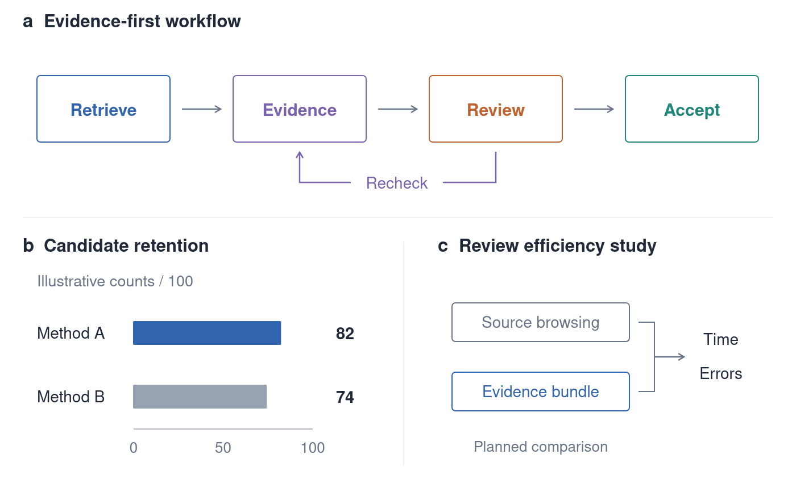

# Simple Fig Skill

简洁的科研论文绘图 skill：**每个面板只有一条短标题，解释放图注，让数据和真实素材成为主角。**

适合方法流程、实验比较、真实图片与定量结果组合。采用克制的机器学习论文视觉风格，既能改良已有图稿，也能从结果数据创建新图；不是 ICLR 官方模板。



上图仅演示布局与配色，数字是明确标注的演示值，不是实验结果。

## 使用

将仓库放入使用方的技能目录。例如在 Codex 中：

```bash
git clone https://github.com/Biogod2020/simple-fig-skill.git ~/.codex/skills/simple-fig-skill
```

示例请求：

> 使用 $simple-fig-skill，根据这些结果和原图素材重画论文图。保留真实图像，围绕新发现调整版式，每个面板只留一条标题，输出 SVG 和 LaTeX PDF 预览。

技能入口是 [SKILL.md](SKILL.md)。它会按任务选择布局，**不固定图数或面板数**；也不会自行发布文件、安装依赖、改变实验或把演示数据当作证据。

## 包含什么

- [风格指南](references/style-guide.md)：标题层级、配色、留白、字号和图形选择。
- [导出与检查](references/export-and-check.md)：SVG → PDF/PNG → LaTeX，以及检查边界。
- [SVG 小工具](scripts/svg_figure.py)：标准库实现，支持原始图片字节内嵌。
- [示例源码](scripts/make_example.py)与[可编辑 SVG](examples/example.svg)。
- [LaTeX 模板](assets/preview.tex)与[已编译的演示预览](examples/preview.pdf)。

```bash
python scripts/make_example.py --out build/example.svg
node scripts/render_svg.cjs build/example.svg
# 将 assets/preview.tex 复制到 build，修改图注后在该目录编译。
```

Python 3.10+ 绘图工具只需标准库；导出 PDF/PNG 需已有的 Playwright + Chromium，LaTeX 预览需相应编译器。环境变量与可选依赖见导出说明。

## 验证

```bash
python -m unittest discover -s tests
RUN_RENDER_TESTS=1 python -m unittest discover -s tests
```

第二条命令还运行浏览器检查，需要 Node、Playwright 和 Chromium。测试覆盖文本转义、无效几何、图片字节保留、旋转/平移后的越界判断与缺失外部素材。自动检查不能替代逐页目视检查、数据来源核验或最终投稿尺寸检查。

本仓库抽象的是视觉风格与工作方法，未包含项目的未发表数据、原始生物图像或私有运行环境。设计思路参考了 [nature-skills](https://github.com/Yuan1z0825/nature-skills) 中原素材优先、简化说明文字的原则；本仓库的说明、工具和演示独立编写，不依赖该仓库安装。
